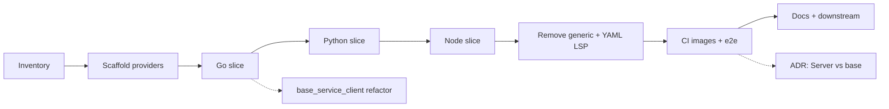

# Implementation plan: generic → language-specific external providers

This document breaks down **how** to implement [generic-provider-to-specific-providers.md](./generic-provider-to-specific-providers.md). It is a working checklist for engineers; it is **not** the normative enhancement text.

**Related:** [konveyor/analyzer-lsp#1013](https://github.com/konveyor/analyzer-lsp/issues/1013), [konveyor/enhancements#262](https://github.com/konveyor/enhancements/pull/262), [downstream tracking](./generic-provider-to-specific-providers-downstream-tracking.md), [Step 0 inventory](./generic-provider-to-specific-providers-step0-inventory.md).

---

## How to use this document

- Work is ordered to **minimize dead ends**: prefer short vertical slices (one language end-to-end) before deleting the generic provider.
- **Copy-first:** For Steps 2–4 (and tests in Step 9), **copy** code into the new provider modules and leave `generic-external-provider` **unchanged** until Step 11 removes it wholesale. That avoids a half-deleted generic tree during the migration.
- Each step ends with **Your notes and corrections**—use those sections to capture decisions, ticket links, or changes to the plan.
- **Parallel tracks:** Container/CI work can follow closely behind the first language slice; the **`lsp/base_service_client` deep refactor** can trail the functional split or proceed in a sub-branch if scope explodes.

---

## High-level phases

---

## Step 0 — Inventory and baseline

### Objectives

- Know every reference to `generic-external-provider`, `SupportedLanguages`, and `lspServerName` selection in this repo and in known downstreams.
- Freeze a **baseline**: current demo/e2e commands that must keep passing until replaced per language.

### Concrete tasks

- Ripgrep (or equivalent) for: `generic-external-provider`, `generic-provider`, `SupportedLanguages`, `yaml_language_server`, paths under `external-providers/generic-external-provider/`. **Record** findings in **[generic-provider-to-specific-providers-step0-inventory.md](./generic-provider-to-specific-providers-step0-inventory.md)** (update that file if the tree changes before implementation).
- List **build surfaces:** root `Makefile` (`external-generic`, `build-generic-provider`, `run-external-providers-local`, pod targets), `.github/workflows/image-build.yaml` (sequential `generic-external-provider-build` after `golang-dependency-provider`), `.github/workflows/demo-testing.yml` (matrix paths, artifact patterns, ttl.sh tags).
- List **config surfaces:** `provider_container_settings.json`, `provider/testdata/*`, `provider_pod_local_settings.json`, `provider_local_external_images.json`, `docs/providers.md`, `external-providers/TESTING.md`, `external-providers/generic-external-provider/docs/README.md`.
- Confirm **`make build`** / **`pr-testing.yml`** implications: `build` depends on `external-generic`; new modules will need Makefile + CI updates later.
- Maintain **[generic-provider-to-specific-providers-downstream-tracking.md](./generic-provider-to-specific-providers-downstream-tracking.md)** as the checklist for operator, kantra/hub, and other consumers (image names, binary paths, release timing). **Do not require opening GitHub issues** as part of this step unless your team wants them—update the tracking doc and ping owners as you prefer.

### Exit criteria

- **[Step 0 inventory](./generic-provider-to-specific-providers-step0-inventory.md)** is filled out and reviewed (grep-backed file list, build/CI/config surfaces, post-migration grep checklist).
- Downstream checklist exists in `generic-provider-to-specific-providers-downstream-tracking.md` (rows filled as you learn owners).

### Your notes and corrections

<!-- Add your notes below this line -->

---

## Step 1 — Scaffold the three provider modules

### Objectives

- Add `external-providers/go-external-provider`, `python-external-provider`, and `nodejs-external-provider` (final names may follow repo naming; align with enhancement: **golang** naming for the Go binary).
- Each module mirrors **`java-external-provider`**: `main.go` (flags: `--port`, `--socket`, `--log-level`, `--name` if still required for rules, TLS flags), `go.mod` with `replace` to the analyzer-lsp module root, `Dockerfile` stub (can copy structure from generic or java and trim later).

### Concrete tasks

- Create package layout, e.g. `pkg/go_external_provider/` (or `golang_external_provider`—pick one convention and use it consistently).
- Implement minimal `BaseClient` that **fails fast** or no-ops until Step 2–4 wire real `Init`/`Capabilities`—*or* skip stub and go straight to lift in Step 2 if you prefer one PR per language.
- Register nothing in a shared `SupportedLanguages` map; each binary owns exactly one service client builder.
- Add `Makefile` targets parallel to `java-external-provider` / `external-generic` for each new binary under `build/`.

### Exit criteria

- `go build` succeeds for each new module; CI can compile them (optional early job) without yet publishing images.

### Your notes and corrections

---

## Step 2 — Extract the Go (gopls) provider

### Objectives

- Move logic from `external-providers/generic-external-provider/pkg/server_configurations/generic/` into the Go provider package.
- Default **`--name`** / advertised provider name should match what **rules and `provider_container_settings`** expect (e.g. `generic` vs `golang`—enhancement prefers explicit **golang**; may require rule or config migration in the same change series).

### Concrete tasks

- **Copy** (do not delete yet) `service_client.go`, tests, and helpers from `server_configurations/generic/` into the Go provider package; fix imports and package names. Leave the generic provider tree intact until Step 11.
- In the **new** module only: `Init` constructs **only** the gopls service client—no `SupportedLanguages` dispatcher.
- Ensure **capabilities** and **Init** behavior match pre-split behavior (diff Capabilities JSON or golden tests if available).
- **Copy** unit tests into the new module (generic copies remain until removal in Step 11).

### Exit criteria

- Running the Go provider binary + analyzer against a small workspace reproduces prior Go analysis behavior (manual or automated).

### Your notes and corrections

<!-- Add your notes below this line -->

---

## Step 3 — Extract the Python (pylsp) provider

### Objectives

- Same as Step 2 for `pkg/server_configurations/pylsp/`.

### Concrete tasks

- **Copy** pylsp `service_client`, tests, and Python-only config constants into the Python provider package (same copy-first rule as Step 2).
- Validate **dependency** / workspace folder handling unchanged.

### Exit criteria

- Python e2e scenario passes when pointed at `python-external-provider` (after Step 10 relocates assets, or temporarily with patched paths).

### Your notes and corrections

<!-- Add your notes below this line -->

---

## Step 4 — Extract the Node.js provider

### Objectives

- Same as Step 2 for `pkg/server_configurations/nodejs/` including `symbol_cache_helper.go` and any Node-specific tests.

### Concrete tasks

- **Copy** Node service client, `symbol_cache_helper.go`, and tests into the Node provider package (copy-first; generic unchanged until Step 11).

### Exit criteria

- Node e2e scenario passes against the new binary (paths as above).

### Your notes and corrections

<!-- Add your notes below this line -->

---

## Step 5 — Remove YAML LSP from the generic stack

### Objectives

- **No** `yaml_language_server` path in the new layout; YAML remains **yq** per enhancement.

### Concrete tasks

- Delete or stop building `pkg/server_configurations/yaml_language_server/` when generic is removed; grep for references in rules, docs, and tests.
- Confirm `provider_container_settings.json` and defaults use **yq-external-provider** for YAML; remove any example pointing YAML analysis at generic.

### Exit criteria

- No remaining import of yaml_language_server from provider code paths that ship; documentation states yq-only for YAML.

### Your notes and corrections

<!-- Add your notes below this line -->

---

## Step 6 — Analyzer gRPC launcher (`provider/grpc/provider.go`)

### Objectives

- Simplify how the analyzer starts external binaries: **`--name`** today is derived from `lspServerName` for the generic binary; language-specific binaries may use a **fixed** name per process or still accept config—decide explicitly and document.

### Concrete tasks

- Read `start()` in `provider/grpc/provider.go` and align behavior with per-binary contracts.
- Audit **rules** and **capabilities** that key off provider name strings.
- Update any tests in `provider/provider_test.go` (or integration tests) that assume generic multi-language behavior.

### Exit criteria

- Analyzer can start each new binary with the intended flags; no dependency on switching `lspServerName` inside one process.

### Your notes and corrections

<!-- Add your notes below this line -->

---

## Step 7 — Default settings, examples, and testdata

### Objectives

- Replace `binaryPath` entries that point at `generic-external-provider` with **per-language** binaries (container paths or local build paths as appropriate).

### Concrete tasks

- Update `provider_container_settings.json`.
- Update `provider/testdata/*` (YAML/JSON provider settings used in tests).
- Search `examples/`, demo configs, and `provider_pod_local_settings.json` (and similar) for generic paths.

### Exit criteria

- All in-repo examples and tests reference the new binaries; CI config pick-up lists updated if paths change.

### Your notes and corrections

<!-- Add your notes below this line -->

---

## Step 8 — Dockerfiles and container images

### Objectives

- **One image per language** (Go, Python, Node); remove the monolithic generic image from the primary build graph.

### Concrete tasks

- **Go image:** Today `generic-external-provider/Dockerfile` likely depends on `golang-dependency-provider`—**only the Go provider image** should retain that `GOLANG_DEP_IMAGE` build-arg pattern; Python/Node images should not bundle unnecessary deps.
- Add `external-providers/<provider>/Dockerfile` for each, modeled on `java-external-provider` or trimmed generic Dockerfile.
- Update **root** `Makefile`: `IMG_GENERIC_PROVIDER` → separate `IMG_GO_PROVIDER`, `IMG_PYTHON_PROVIDER`, `IMG_NODE_PROVIDER` (names TBD); fix `run-external-providers-local`, `run-external-providers-pod`, and any demo targets that run three containers from one image.
- Update `.github/workflows/image-build.yaml`:
  - Add three matrix entries (or jobs) for the new images.
  - Replace the sequential **`generic-external-provider-build`** job with jobs that depend on `golang-dependency-provider` **only where needed**.
- Search other workflows (release, nightly, security scan) for `generic-external-provider`.

### Exit criteria

- CI publishes (or PR-builds) three distinct images; local `podman build` instructions work per provider.

### Your notes and corrections

<!-- Add your notes below this line -->

---

## Step 9 — Unit tests and `lsp/base_service_client`

### Objectives

- Preserve behavior; **copy** tests into new packages alongside Steps 2–4; treat **`lsp/base_service_client` refactor as a later gate**: start only when the per-language split, images, and e2e paths are stable (Steps 1–8 and 10 as needed).

### Concrete tasks

- **Copy** `service_client_test.go` files into new provider packages (duplicates under generic remain until Step 11).
- Add/adjust tests for `Capabilities`/`Init` on each `BaseClient`.
- **Defer** deep `base_service_client` restructuring until prior steps are validated in CI and review; then plan slices: (1) rename/extract files with no behavior change, (2) reduce cross-coupling, (3) document extension points.
- Keep **`BaseClient` / `ServiceClient` and gRPC API** stable (non-goals in enhancement).

### Exit criteria

- `go test ./...` (or scoped packages) green; coverage not worse for copied code. **Refactor sub-tasks** begin only after the team agrees Steps 2–8 (and e2e relocation) are solid.

### Your notes and corrections

<!-- Add your notes below this line -->

---

## Step 10 — E2E / demo tests and `demo-testing.yml`

### Objectives

- **Per-provider e2e directories** like Java/yq: move `golang-e2e`, `python-e2e`, `nodejs-e2e` out of `generic-external-provider/e2e-tests/` into each provider’s `e2e-tests/`.
- Update **`provider_settings.json`** inside each e2e folder to reference the correct **image/binary** and provider names.

### Concrete tasks

- Physical move of `demo-output.yaml`, `provider_settings.json`, `rule-example.yaml` per `external-providers/TESTING.md`.
- Edit `.github/workflows/demo-testing.yml`: matrix `demo-output-path`, `provider_settings-path`, `testing-rules`, **path filters**, **artifact patterns** (today `*{analyzer-lsp,generic-external-provider}`—split so each language job pulls the right provider image artifact).
- Update ttl.sh / test tag steps if they still tag only `konveyor-generic-external-provider-*`.
- Refresh **`external-providers/TESTING.md`** and **`docs/development/testing.md`** directory tree diagrams.

### Exit criteria

- Demo workflow passes for Go, Python, and Node on distinct paths; no language-specific e2e left under `generic-external-provider/e2e-tests/`.

### Your notes and corrections

<!-- Add your notes below this line -->

---

## Step 11 — Delete `generic-external-provider` and cleanup

### Objectives

- Remove the old binary, module, Dockerfile, and docs; eliminate dead Makefile and workflow targets.

### Concrete tasks

- Delete `external-providers/generic-external-provider/` once all references are migrated—this drops the **duplicate** copies of language code and tests that lived alongside the new providers during Steps 2–4 and 9.
- Remove `external-generic` Makefile target and `build` dependency chain entries; fix `go.work` if the repo uses a workspace file listing modules.
- Final grep for stale strings; update any badges or release scripts.

### Exit criteria

- Repository builds without generic provider; no dangling imports.

### Your notes and corrections

<!-- Add your notes below this line -->

---

## Step 12 — Documentation and user-facing migration

### Objectives

- Operators and integrators know how to migrate from one generic binary to three.

### Concrete tasks

- Update `docs/providers.md`, generic provider README (remove or replace with pointers to three providers), enhancement-linked **migration** subsection if desired.
- Document **image names** on quay.io (or registry), **binary names** in container default paths, and **breaking change** (pin old images if needed).
- Update **[generic-provider-to-specific-providers-downstream-tracking.md](./generic-provider-to-specific-providers-downstream-tracking.md)** with operator PR links, kantra/hub changes, and release coordination when known (per @jortel on PR #262 for Python/Node extension images).

### Exit criteria

- A new user can configure Go/Python/Node from docs alone; release notes drafted.

### Your notes and corrections

<!-- Add your notes below this line -->

---

## Step 13 — Post-split follow-up (ADR)

### Objectives

- Satisfy the enhancement **follow-up**: compare **refactored `lsp/base_service_client`** vs **thinner LSP layer** with **`provider.NewServer` / `ServiceClient`** as the main boundary; record decision.

### Concrete tasks

- Short design note or ADR in-repo: criteria, chosen direction, implications for TLS/token usage on gRPC if relevant.

### Exit criteria

- Linked from enhancement or implementation plan; team agreement documented.

### Your notes and corrections

<!-- Add your notes below this line -->

---

## Cross-cutting risks (watch throughout)

| Risk | Mitigation |
|------|------------|
| Provider **name** string changes break rules | Grep rules and tests; provide mapping table generic → golang if renamed |
| **Image build DAG** wrong (Go dep image) | Keep golang-dependency-provider only on Go provider image job |
| **CI artifact** matrix misses new images | Update `artifact_pattern` per job in demo-testing |
| **Scope creep** on `base_service_client` | Time-box; ship split first, refactor in follow-up PRs |
| **Downstream drift** | Keep [downstream tracking doc](./generic-provider-to-specific-providers-downstream-tracking.md) current; version coupling documented there |

### Your notes and corrections (cross-cutting)

<!-- Add your notes below this line -->

---

## Suggested PR slicing (optional)

1. **Scaffold + Go provider + Makefile + settings** (vertical slice; **copy** from generic, generic unchanged).
2. **Python + Node providers** (parallel PRs possible after patterns settle).
3. **Docker + image-build + demo-testing + e2e moves**.
4. **Remove generic + doc + cleanup**.
5. **`base_service_client` refactor** (one or more PRs).
6. **ADR** for Server vs base layering.

### Your notes and corrections (PR strategy)

<!-- Add your notes below this line -->

