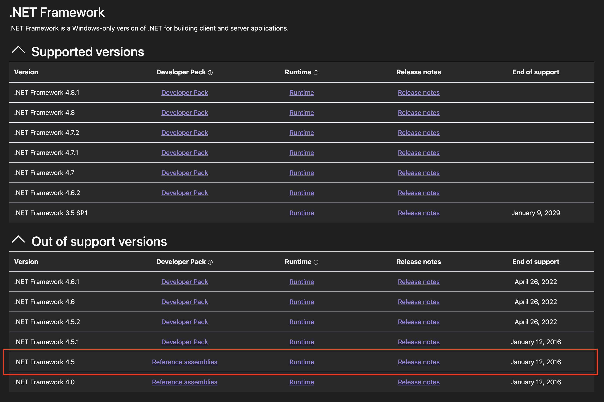
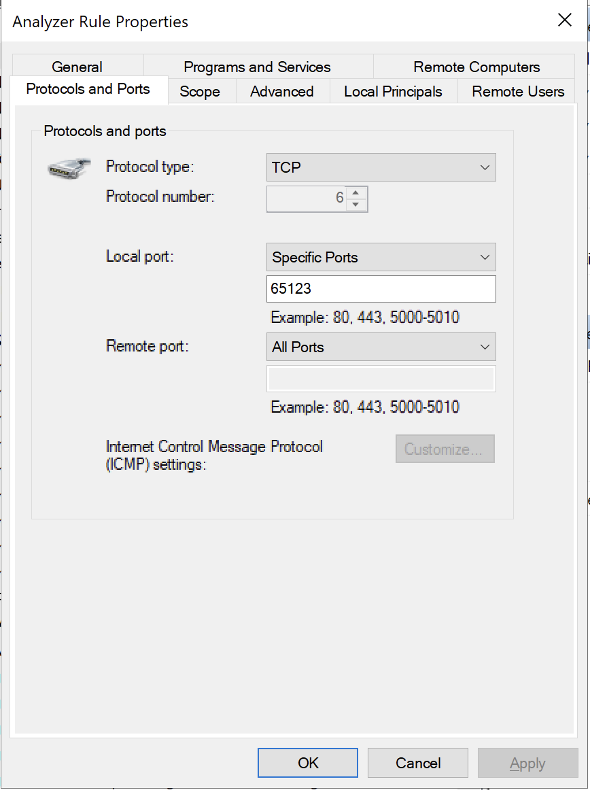

# Nerd Dinner

Demonstrated in the [21 March 2024 Konveyor Community Meeting](https://docs.google.com/document/d/18vsvW8aO1iJqCXUCi-X2_PjfzuSVE5Ue3vgxlTYl10g/edit?pli=1#heading=h.sid211hnq1wl)

This example demonstrates our ability to perform rules based analysis of a .NET
Framework 4.5 project like [nerd-dinner](https://github.com/sixeyed/nerd-dinner)
given a Windows host capable of building it.

# Requirements

* A Windows instance. Since .NET Framework 4.5 is a Windows only framework, our
  provider MUST run on a Windows host prepared to build the project we want to
  analyze (in our case nerd-dinner). **This example** was tested to work on an
  Amazon Lightsail instance of Windows Server 2022 (16 GB RAM, 4 vCPUs, 320 GB
  SSD).

# Procedure

## Prepare the Host

**NOTE** These steps intentionally avoid being explicit in what must be done in
order to prepare the host opting instead to include references to helpful
resources and describe clearly the expected final state. This is to minimize
the maintenance burden of this particular example.

### Install Language Server

Install the [csharp-language-server](https://github.com/razzmatazz/csharp-language-server).

Running `csharp-ls.exe --version` from PowerShell will return the version
installed and confirm proper installation:

```powershell
PS C:\> csharp-ls.exe --version
csharp-ls, 0.9.0.0
```

### Download the .NET Provider

Grab windows executables from the
[releases page](https://github.com/konveyor/analyzer-lsp/releases) or grab from
the latest container image:

```shell
podman run --name dotnet --entrypoint /bin/bash quay.io/konveyor/dotnet-external-provider:latest
podman cp dotnet:/usr/bin/dotnet-external-provider-windows-amd64.exe .
podman rm dotnet
```

Confirm installation on the Windows host:

```powershell
PS C:\> .\dotnet-provider-windows.exe --help
Usage of C:\Users\Administrator\dotnet-provider-windows.exe:
  -log-level int
        Level to log (default 5)
  -port int
        Port must be set
```

### Clone the Repository

Install [Git](https://git-scm.com/downloads). Then,
either from the Git-Gui or Powershell, clone the
[nerd-dinner](https://github.com/sixeyed/nerd-dinner) repository.

### Install .NET SDK(s)

In this step, what we are trying to accomplish is make the nerd-dinner project
buildable on this host.

Find .NET Framework reference assemblies
[here](https://dotnet.microsoft.com/en-us/download/visual-studio-sdks?cid=msbuild-developerpacks).



Confirm nerd-dinner can be built with both `dotnet build` and `dotnet msbuild`.

**NOTE** Confirmation that the project can be built using `dotnet msbuild` is
of critical importance because the language server uses the `msbuild` tools and
libraries to perform symbol queries for the project. This article
[Building a project that target .NET Framework 4.5 in Visual Studio 2022](https://thomaslevesque.com/2021/11/12/building-a-project-that-target-net-45-in-visual-studio-2022/)
may help resolve issues using the `msbuild` tooling.

## Make Host Accessible

Since `analyzer-lsp` will be running on localhost, having a usable open port
for network traffic to reach the Windows Server is essential. This resource,
[How to Open a Port in Windows Server Firewall](https://computingforgeeks.com/how-to-open-a-port-in-windows-server-firewall/)
may be useful to open a port.



## Analyze the Project

At this point we have a Windows host with our nerd-dinner project cloned and
all of the necessary software to build and analyze it installed. Now all we
need to do is:

1. Start the provider. From the command prompt, `.\dotnet-provider-windows.exe -port 65123`
1. Prepare the [provider settings](./provider-settings-example.json).
1. Run the analysis. From source that would look like `go run cmd/analyzer/main.go --provider-settings path/to/provider-settings-example.json --rules path/to/rule.yaml`

The `output.yaml` should look similar to:

```yaml
- name: konveyor-analysis
  violations:
    lang-ref-example-001:
      description: ""
      category: potential
      incidents:
      - uri: file:///C:\Users\Administrator\nerd-dinner-git\mvc4\NerdDinner\Controllers\DinnersController.cs
        message: HttpNotFound was replaced with NotFound in .NET Core
        lineNumber: 35
        variables:
          file: file:///C:\Users\Administrator\nerd-dinner-git\mvc4\NerdDinner\Controllers\DinnersController.cs
      - uri: file:///C:\Users\Administrator\nerd-dinner-git\mvc4\NerdDinner\Controllers\DinnersController.cs
        message: HttpNotFound was replaced with NotFound in .NET Core
        lineNumber: 88
        variables:
          file: file:///C:\Users\Administrator\nerd-dinner-git\mvc4\NerdDinner\Controllers\DinnersController.cs
      - uri: file:///C:\Users\Administrator\nerd-dinner-git\mvc4\NerdDinner\Controllers\DinnersController.cs
        message: HttpNotFound was replaced with NotFound in .NET Core
        lineNumber: 126
        variables:
          file: file:///C:\Users\Administrator\nerd-dinner-git\mvc4\NerdDinner\Controllers\DinnersController.cs
```

# Conclusion

At this point, we have effectively demonstrated our ability to analyze a .NET
Framework 4.5 project for which support was dropped in January 12, 2016. Pretty
cool right?

What's next? If you made it through this example and have experience with .NET,
we would love for you to [contribute](https://github.com/konveyor/community/blob/main/CONTRIBUTING.md)
or [reach out](https://github.com/konveyor/community#communication) to help
make this better.
